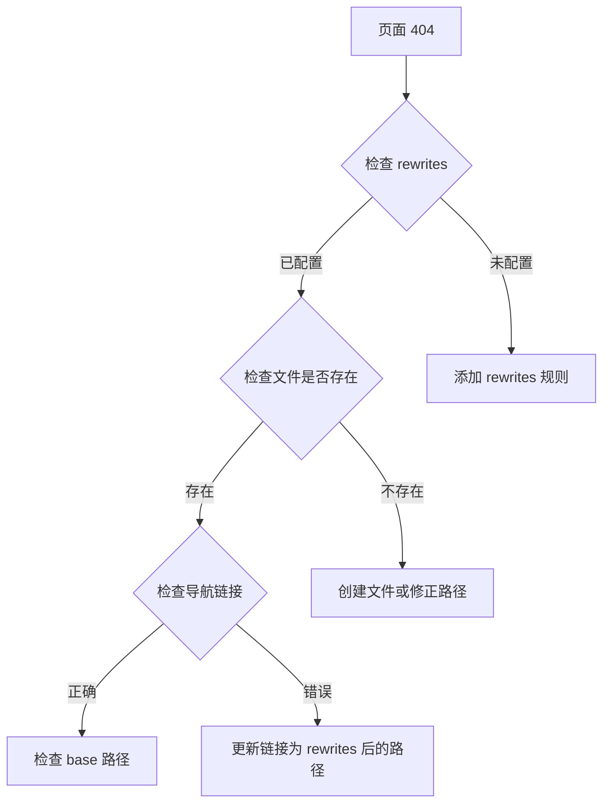

# VitePress + 糖果主题博客搭建完整指南

本文档详细记录了从零开始搭建一个基于 VitePress 和糖果主题的前端知识管理博客的完整过程，以及在实际部署中遇到的所有问题和解决方案。

## 1. 项目概述

### 1.1 技术栈

| 技术 | 版本 | 说明 |
|------|------|------|
| [VitePress](https://vitepress.dev/) | ^1.5.0 | 基于 Vite 的静态站点生成器 |
| [@sugarat/theme](https://theme.sugarat.top/) | ^0.4.10 | 功能丰富的博客主题 |
| [Vue 3](https://vuejs.org/) | ^3.5.12 | 渐进式 JavaScript 框架 |
| [TypeScript](https://www.typescriptlang.org/) | - | JavaScript 的超集 |
| [Pagefind](https://pagefind.app/) | ^1.4.0 | 静态站点全文搜索 |
| [pnpm](https://pnpm.io/) | ^9.0.0 | 快速、节省磁盘空间的包管理器 |
| [Node.js](https://nodejs.org/) | >=18.0.0 | JavaScript 运行时 |

### 1.2 项目特点

- 🚀 **极速开发体验** - Vite 驱动，开发服务器秒级启动
- 💎 **Vue 3 + TypeScript** - 现代化的技术栈
- 📝 **Markdown 增强** - 支持代码高亮、自定义容器
- 🎨 **美观的博客主题** - 基于糖果主题，功能丰富
- 🔍 **全文搜索** - Pagefind 提供强大的搜索功能
- 📱 **响应式设计** - 完美适配移动端和桌面端
- 🌙 **暗色模式** - 内置明暗双主题
- 🎯 **自动部署** - GitHub Actions CI/CD

### 1.3 目录结构

```
FrontendNotes/
├── .github/                    # GitHub 配置
│   └── workflows/              # GitHub Actions 工作流
│       ├── ci.yml             # CI 配置
│       └── deploy.yml         # 部署配置
├── docs/                       # 文档源文件
│   ├── .vitepress/            # VitePress 配置
│   │   ├── config.mts         # 核心配置文件
│   │   └── theme/             # 主题自定义
│   ├── public/                # 静态资源
│   │   └── img/               # 图片资源
│   ├── guide/                 # 指南文档
│   ├── 《JavaScript教程》笔记/
│   ├── 《ES6 教程》笔记/
│   ├── 《Vue》笔记/
│   ├── 《React》笔记/
│   ├── 《TypeScript 从零实现 axios》/
│   └── index.md               # 首页
├── package.json               # 项目依赖
├── pnpm-lock.yaml            # pnpm 锁文件
└── README.md                  # 项目说明

```

## 2. 从零开始搭建

### 2.1 环境准备

#### 安装 Node.js

确保安装了 Node.js 18.0.0 或更高版本：

```bash
# 检查 Node.js 版本
node -v

# 如果版本过低，访问 https://nodejs.org/ 下载安装最新 LTS 版本
```

#### 安装 pnpm

推荐使用 pnpm 作为包管理器（更快、更节省磁盘空间）：

```bash
# 使用 npm 全局安装 pnpm
npm install -g pnpm

# 验证安装
pnpm -v
```

#### 配置 Git

```bash
# 配置用户信息
git config --global user.name "Your Name"
git config --global user.email "your.email@example.com"

# 配置默认分支名
git config --global init.defaultBranch main
```

### 2.2 项目初始化

#### 创建项目目录

```bash
# 创建项目目录
mkdir FrontendNotes
cd FrontendNotes

# 初始化 Git
git init

# 创建基础目录结构
mkdir -p docs/.vitepress docs/public/img
```

#### 初始化 package.json

```bash
# 初始化项目
pnpm init
```

编辑 `package.json`，添加必要的依赖和脚本：

```json
{
  "name": "frontend-notes",
  "version": "2.0.0",
  "description": "现代化的前端知识管理和学习笔记平台",
  "type": "module",
  "scripts": {
    "dev": "vitepress dev docs",
    "build": "vitepress build docs",
    "preview": "vitepress preview docs"
  },
  "devDependencies": {
    "@sugarat/theme": "^0.4.10",
    "@types/node": "^22.9.1",
    "medium-zoom": "^1.1.0",
    "pagefind": "^1.4.0",
    "sass": "^1.80.6",
    "vitepress": "^1.5.0",
    "vue": "^3.5.12"
  },
  "dependencies": {
    "dayjs": "^1.11.13"
  },
  "engines": {
    "node": ">=18.0.0",
    "pnpm": ">=9.0.0"
  }
}
```

#### 安装依赖

```bash
pnpm install
```

:::warning 注意
如果遇到 `ERR_PNPM_OUTDATED_LOCKFILE` 错误，使用 `pnpm install --no-frozen-lockfile` 更新锁文件。
:::

### 2.3 核心配置

#### 创建 VitePress 配置文件

创建 `docs/.vitepress/config.mts`：

```typescript
import { defineConfig } from "vitepress";
import { getThemeConfig } from "@sugarat/theme/node";

// 站点基础配置
const DOMAIN_NAME = "yourusername.github.io";
const BASE_PATH = "/YourRepoName/";
const WEB_SITE = `https://${DOMAIN_NAME}${BASE_PATH}`;

// 根据环境动态设置路径前缀
const ASSETS_PATH = process.env.GITHUB_ACTIONS ? BASE_PATH : "/";

// 糖果主题配置
const blogTheme = getThemeConfig({
  author: "Your Name",
  search: {
    btnPlaceholder: "搜索",
    placeholder: "搜索文档",
    emptyText: "暂无结果",
  },
});

export default defineConfig({
  extends: blogTheme,
  
  // 部署基础路径
  base: process.env.GITHUB_ACTIONS ? BASE_PATH : "/",
  
  // 站点元信息
  lang: "zh-CN",
  title: "前端笔记",
  description: "前端技术博客",
  
  // HTML Head 配置
  head: [
    ["link", { rel: "icon", type: "image/png", href: `${ASSETS_PATH}img/logo.png` }],
  ],
  
  // 主题配置
  themeConfig: {
    logo: "/img/logo.png",
    nav: [
      { text: "首页", link: "/" },
    ],
    sidebar: {},
    socialLinks: [
      { icon: "github", link: "https://github.com/yourusername" },
    ],
  },
});
```

#### 创建首页

创建 `docs/index.md`：

```markdown
---
layout: home

hero:
  name: "我的博客"
  text: "Web前端技术博客"
  tagline: 积跬步以至千里，致敬每个爱学习的你
  actions:
    - theme: brand
      text: 开始阅读
      link: /guide/
    - theme: alt
      text: GitHub
      link: https://github.com/yourusername
---
```

#### 启动开发服务器

```bash
pnpm run dev
```

访问 `http://localhost:5173` 查看效果。

## 3. 问题解决实录

在实际部署过程中，遇到了一系列问题。以下详细记录每个问题的排查和解决过程。

### 3.1 CI/CD 部署问题

#### 问题 1：pnpm install --frozen-lockfile 失败

**问题描述**

在 GitHub Actions CI 执行时报错：

```
Run pnpm install --frozen-lockfile
WARN  Ignoring not compatible lockfile at /home/runner/work/FrontendNotes/FrontendNotes/pnpm-lock.yaml
ERR_PNPM_NO_LOCKFILE  Cannot install with "frozen-lockfile" because pnpm-lock.yaml is absent
Error: Process completed with exit code 1.
```

**根本原因**

- CI workflow 中使用的是 pnpm 8
- 本地开发环境使用的是 pnpm 9
- pnpm 9 生成的 lockfile 格式与 pnpm 8 不兼容
- pnpm 8 无法读取新格式的 lockfile，导致安装失败

**解决方案**

更新 `.github/workflows/ci.yml` 和 `.github/workflows/deploy.yml`：

```yaml
- name: 安装 pnpm
  uses: pnpm/action-setup@v3
  with:
    version: 9  # 从 8 升级到 9
```

**验证方法**

```bash
# 提交并推送更改
git add .github/workflows/
git commit -m "fix: 升级 CI 中的 pnpm 版本到 9"
git push

# 在 GitHub Actions 页面查看 workflow 执行结果
```

:::tip 经验总结
CI 环境和本地环境的工具版本应保持一致，避免兼容性问题。
:::

---

#### 问题 2：触发分支配置错误

**问题描述**

推送代码后 GitHub Actions 没有自动触发。

**根本原因**

- 项目使用的是 `main` 分支
- CI workflow 配置的触发分支是 `master`
- 分支名不匹配导致 workflow 不执行

**解决方案**

更新 workflow 配置中的分支名：

```yaml
# 修改前
on:
  push:
    branches:
      - master

# 修改后
on:
  push:
    branches:
      - main
```

**涉及文件**
- `.github/workflows/ci.yml`
- `.github/workflows/deploy.yml`

:::warning 注意
Git 默认分支名在不同版本中可能不同（master vs main），配置时需要与实际分支名保持一致。
:::

---

#### 问题 3：pagefind 命令未找到

**问题描述**

构建过程中报错：

```
=== pagefind: https://pagefind.app/ ===
npx pagefind --site "/home/runner/work/FrontendNotes/FrontendNotes/docs/.vitepress/dist"
sh: 1: pagefind: not found
build error: Command failed
Error: Process completed with exit code 1
```

**根本原因**

- 糖果主题配置了 `search: "pagefind"`
- VitePress 插件在构建时会调用 `pagefind` 命令生成索引
- `pagefind` 包未在 `package.json` 中显式声明
- CI 环境中无法找到该命令

**解决方案**

在 `package.json` 中添加 `pagefind` 依赖：

```json
{
  "devDependencies": {
    "@sugarat/theme": "^0.4.10",
    "@types/node": "^22.9.1",
    "medium-zoom": "^1.1.0",
    "pagefind": "^1.4.0",  // 添加这一行
    "sass": "^1.80.6",
    "vitepress": "^1.5.0",
    "vue": "^3.5.12"
  }
}
```

然后重新安装依赖：

```bash
pnpm install
git add package.json pnpm-lock.yaml
git commit -m "fix: 添加 pagefind 依赖"
git push
```

:::tip 最佳实践
项目中使用的所有命令行工具都应该在 `package.json` 中显式声明，确保 CI 环境能正确安装。
:::

---

#### 问题 4：GitHub Pages 部署失败

**问题描述**

GitHub Actions 执行成功，但部署到 GitHub Pages 时报错：

```
Error: Creating Pages deployment failed
Error: HttpError: Not Found
```

**根本原因**

GitHub Pages 的部署模式配置不正确。默认情况下，GitHub Pages 使用"从分支部署"模式，而不是"GitHub Actions"模式。

**解决方案**

1. 访问仓库设置页面：
   ```
   https://github.com/your-username/your-repo/settings/pages
   ```

2. 在 "Build and deployment" 部分：
   - **Source**: 从 "Deploy from a branch" 改为 "GitHub Actions"

3. 保存设置后，重新触发 workflow

**详细步骤（带截图说明）**

1. 进入仓库主页
2. 点击 "Settings" 标签
3. 左侧菜单点击 "Pages"
4. "Source" 下拉框选择 "GitHub Actions"
5. 页面会自动保存

**验证方法**

```bash
# 推送任意更改触发部署
git commit --allow-empty -m "trigger deployment"
git push

# 访问 Pages URL 查看是否部署成功
# https://your-username.github.io/your-repo/
```

:::danger 重要
必须在仓库设置中启用 "GitHub Actions" 部署模式，否则无法使用 Actions 部署到 Pages。
:::

---

#### 问题 5：Jekyll 构建干扰

**问题描述**

网站部署成功但存在严重问题：
- 网站完全没有 CSS 样式
- 所有页面链接点击都是 404
- 静态资源（JS、CSS）无法加载

**根本原因**

GitHub Pages 默认使用 Jekyll 来构建网站。当检测到 VitePress 生成的静态文件时，Jekyll 会：
- 忽略以 `_` 开头的目录（如 `_assets/`）
- 重新处理 HTML 文件
- 破坏了 VitePress 的构建产物

**解决方案**

在构建产物根目录添加 `.nojekyll` 文件，告诉 GitHub Pages 跳过 Jekyll 处理。

更新 CI workflow：

```yaml
# .github/workflows/ci.yml
- name: 构建文档
  run: pnpm run build

- name: 添加 .nojekyll 文件
  run: touch docs/.vitepress/dist/.nojekyll

- name: 部署到 GitHub Pages
  uses: peaceiris/actions-gh-pages@v3
  # ...
```

同样更新 `deploy.yml`：

```yaml
- name: Build
  run: pnpm run build

- name: Add .nojekyll file
  run: touch docs/.vitepress/dist/.nojekyll
```

**完整的 deploy.yml 示例**

```yaml
name: Deploy to GitHub Pages

on:
  push:
    branches:
      - main

permissions:
  contents: read
  pages: write
  id-token: write

jobs:
  build:
    runs-on: ubuntu-latest
    steps:
      - uses: actions/checkout@v3
        with:
          fetch-depth: 0
      
      - name: Setup pnpm
        uses: pnpm/action-setup@v2
        with:
          version: 9
      
      - name: Setup Node
        uses: actions/setup-node@v3
        with:
          node-version: 18
          cache: pnpm
      
      - name: Install dependencies
        run: pnpm install
      
      - name: Build
        run: pnpm run build
      
      - name: Add .nojekyll file
        run: touch docs/.vitepress/dist/.nojekyll
      
      - name: Upload artifact
        uses: actions/upload-pages-artifact@v2
        with:
          path: docs/.vitepress/dist
  
  deploy:
    environment:
      name: github-pages
      url: ${{ steps.deployment.outputs.page_url }}
    runs-on: ubuntu-latest
    needs: build
    steps:
      - name: Deploy to GitHub Pages
        id: deployment
        uses: actions/deploy-pages@v2
```

**验证方法**

1. 提交并推送更改
2. 等待 GitHub Actions 完成部署
3. 访问网站，检查：
   - CSS 样式是否正常加载
   - 页面链接是否正常工作
   - 浏览器开发者工具 Network 标签中资源是否全部加载成功

:::tip 关键知识点
`.nojekyll` 文件是一个空文件，放在网站根目录即可。它告诉 GitHub Pages："这是一个预构建的静态网站，不要用 Jekyll 处理"。
:::

---

### 3.2 路径和路由问题

#### 问题 6：base 路径大小写不匹配

**问题描述**

网站部署后所有资源 404，包括 CSS、JS 和图片。

**根本原因**

配置文件中的 `base` 路径使用小写：

```typescript
const BASE_PATH = "/frontend-notes/";  // 小写
```

但 GitHub 仓库名是：`FrontendNotes`（驼峰命名）

GitHub Pages 的 URL 区分大小写：
- ❌ 错误：`https://username.github.io/frontend-notes/`
- ✅ 正确：`https://username.github.io/FrontendNotes/`

所有资源请求都使用了错误的路径前缀，导致 404。

**解决方案**

修正 `docs/.vitepress/config.mts` 中所有路径引用：

```typescript
// 修改前
const BASE_PATH = "/frontend-notes/";

// 修改后
const BASE_PATH = "/FrontendNotes/";
```

同时检查并修正其他使用仓库名的地方：

```typescript
// 评论系统配置
comment: {
  repo: "username/FrontendNotes",  // 确保大小写正确
}

// 页脚链接
footer: {
  message: '<a href="https://github.com/username/FrontendNotes/blob/main/LICENSE">MIT License</a>',
}

// 编辑链接
editLink: {
  pattern: "https://github.com/username/FrontendNotes/edit/main/docs/:path",
}
```

**涉及的配置项**

1. `BASE_PATH` 常量
2. `base` 配置
3. `comment.repo`
4. `footer.message` 中的链接
5. `editLink.pattern`

**验证方法**

```bash
# 本地构建测试
pnpm run build
pnpm run preview

# 访问 http://localhost:4173 检查资源是否正常加载
```

:::danger 大小写敏感
GitHub Pages URL 是区分大小写的！务必确保配置文件中的路径与实际仓库名大小写完全一致。
:::

---

#### 问题 7：导航栏链接 404（Vue/React/TypeScript）

**问题描述**

点击导航栏中的 "Vue"、"React"、"TypeScript 从零实现 axios" 链接时出现 404 错误。

**问题分析**

导航栏配置使用的是原始文件路径：

```typescript
nav: [
  {
    text: "学习笔记",
    items: [
      { text: "Vue", link: "/《Vue》笔记/01.基础/" },
      { text: "React", link: "/《React》笔记/01.核心概念/" },
      { text: "TypeScript", link: "/《TypeScript 从零实现 axios》/01.初识 TypeScript/" },
    ],
  },
]
```

但这些路径没有配置 `rewrites` 规则，VitePress 无法找到对应的页面。

**解决方案（分三步）**

**第1步：添加 rewrites 规则**

在 `config.mts` 中添加路径重写规则：

```typescript
export default defineConfig({
  rewrites: {
    // Vue 笔记
    "《Vue》笔记/01.基础/:path*": "pages/vue-basics/:path*",
    
    // React 笔记
    "《React》笔记/01.核心概念/:path*": "pages/react-core/:path*",
    
    // TypeScript 笔记
    "《TypeScript 从零实现 axios》/:path*": "pages/ts-axios/:path*",
  },
});
```

**第2步：更新导航栏链接**

使用重写后的路径：

```typescript
nav: [
  {
    text: "学习笔记",
    items: [
      { text: "Vue", link: "/pages/vue-basics/" },
      { text: "React", link: "/pages/react-core/" },
      { text: "TypeScript", link: "/pages/ts-axios/" },
    ],
  },
]
```

**第3步：创建 index.md 首页**

为每个目录创建首页，例如 `docs/《TypeScript 从零实现 axios》/index.md`：

```markdown
---
title: TypeScript 从零实现 axios
date: 2024-01-01
permalink: /pages/ts-axios/
article: false
---

# TypeScript 从零实现 axios

本教程将带你从零开始，使用 TypeScript 实现一个类似 axios 的 HTTP 库。

## 学习路径

- [初识 TypeScript](./01.初识%20TypeScript/)
- [TypeScript 常用语法](./02.TypeScript%20常用语法/)
- ...
```

**rewrites 工作原理**

```
原始文件路径: docs/《Vue》笔记/01.基础/00.MVVM模式.md
↓ rewrites 转换
访问 URL: /pages/vue-basics/00.MVVM模式.html
```

:::tip rewrites 最佳实践
- 使用通配符 `:path*` 匹配目录下所有文件
- 为所有重写的路径创建 index.md 作为目录首页
- 导航链接始终使用重写后的路径
:::

---

#### 问题 8：ES6 教程全部 404

**问题描述**

访问任何 ES6 教程文章都返回 404，例如：
```
https://username.github.io/FrontendNotes/《ES6 教程》笔记/01.ECMAScript 6 简介.html
```

**问题分析**

1. ES6 教程没有配置 rewrites 规则
2. 侧边栏配置使用的文件名（如 `01.ECMAScript 6 简介.md`）在目录中不存在
3. 实际文件使用英文命名（如 `intro.md`、`let.md`）

**解决方案**

**第1步：检查实际文件名**

```bash
cd docs/《ES6 教程》笔记/
ls -la

# 输出：
# intro.md
# let.md
# destructuring.md
# string.md
# ...
```

**第2步：添加 rewrites 规则**

```typescript
rewrites: {
  "《ES6 教程》笔记/:path*": "pages/es6-tutorial/:path*",
}
```

**第3步：创建 ES6 教程首页**

创建 `docs/《ES6 教程》笔记/index.md`：

```markdown
---
title: ES6 教程笔记
date: 2024-01-01
permalink: /pages/es6-tutorial/
article: false
---

# ES6 教程笔记

## 学习目录

### 基础语法
- [ECMAScript 6 简介](./intro)
- [let 和 const 命令](./let)
- [变量的解构赋值](./destructuring)

### 数据类型扩展
- [字符串的扩展](./string)
- [字符串的新增方法](./string-methods)
- [数值的扩展](./number)
- ...
```

**第4步：更新侧边栏配置**

使用实际存在的文件名：

```typescript
sidebar: {
  "/pages/es6-tutorial/": [
    {
      text: "ES6 教程",
      collapsed: false,
      items: [
        { text: "ES6 简介", link: "/pages/es6-tutorial/intro" },
        { text: "let 和 const", link: "/pages/es6-tutorial/let" },
        { text: "解构赋值", link: "/pages/es6-tutorial/destructuring" },
        { text: "字符串扩展", link: "/pages/es6-tutorial/string" },
        // ...
      ],
    },
  ],
}
```

**第5步：更新导航栏链接**

```typescript
nav: [
  {
    text: "学习笔记",
    items: [
      { text: "ES6 教程", link: "/pages/es6-tutorial/" },
    ],
  },
]
```

:::warning 文件名匹配问题
确保侧边栏配置中的链接与实际文件名完全匹配（包括大小写和扩展名）。
:::

---

#### 问题 9：首页特性卡片链接 404

**问题描述**

首页的 features 卡片点击后出现 404：

```markdown
features:
  - icon: 🎨
    title: 页面设计
    link: /02.页面/10.HTML/
```

访问 `/02.页面/10.HTML/` 返回 404。

**根本原因**

`index.md` 中的 feature 链接使用的是原始文件路径，但这些路径已经通过 rewrites 重写为新路径。

**解决方案**

更新 `docs/index.md` 中所有 feature 链接：

```markdown
features:
  - icon: 💻
    title: 前端技术
    details: JavaScript、ES6、TypeScript、Vue、React 等前端技术文章
    link: /pages/javascript/
    
  - icon: 🎨
    title: 页面设计
    details: HTML5/CSS3、响应式设计、前端页面开发相关技术
    link: /ui/html/
    
  - icon: 🛠️
    title: 技术文档
    details: 技术文档、教程、技巧、总结等实用内容
    link: /pages/tech-docs/
    
  - icon: 📚
    title: 学习笔记
    details: JavaScript、ES6、Vue、React、Git 等技术学习笔记
    link: /pages/js-tutorial/
    
  - icon: 🎯
    title: 面试题库
    details: 前端面试题目整理和解答
    link: /pages/interview/
    
  - icon: 💡
    title: 实用技巧
    details: 开发中的实用技巧和经验分享
    link: /pages/tips/
```

**rewrites 路径映射表**

| 原始路径 | 重写后路径 |
|---------|-----------|
| `/01.前端/25.JavaScript文章/` | `/pages/javascript/` |
| `/02.页面/10.HTML/` | `/ui/html/` |
| `/02.页面/20.CSS/` | `/ui/css/` |
| `/03.技术/01.技术文档/` | `/pages/tech-docs/` |
| `/04.更多/03.面试/` | `/pages/interview/` |
| `/04.更多/10.实用技巧/` | `/pages/tips/` |

:::tip 保持一致性
所有内部链接（导航栏、侧边栏、首页卡片）都应该使用 rewrites 后的路径。
:::

---

### 3.3 UI 和配置问题

#### 问题 10：favicon 不显示

**问题描述**

网站部署后，浏览器标签页显示的是默认的地球图标，而不是配置的 logo。

**根本原因**

配置使用的是相对路径：

```typescript
head: [
  ["link", { rel: "icon", href: "/img/logo.png" }],
]
```

在子路径部署时（如 `/FrontendNotes/`），浏览器会从错误的路径加载 favicon：
- ❌ `https://username.github.io/img/logo.png`
- ✅ `https://username.github.io/FrontendNotes/img/logo.png`

**解决方案**

使用动态路径配置：

```typescript
// 在配置文件顶部定义
const BASE_PATH = "/FrontendNotes/";
const ASSETS_PATH = process.env.GITHUB_ACTIONS ? BASE_PATH : "/";

// 在 head 配置中使用
export default defineConfig({
  head: [
    // 支持多种设备和格式
    [
      "link",
      {
        rel: "icon",
        type: "image/x-icon",
        href: `${ASSETS_PATH}img/favicon.svg`,
      },
    ],
    [
      "link",
      {
        rel: "icon",
        type: "image/png",
        sizes: "32x32",
        href: `${ASSETS_PATH}img/logo.png`,
      },
    ],
    [
      "link",
      {
        rel: "apple-touch-icon",
        sizes: "180x180",
        href: `${ASSETS_PATH}img/logo.png`,
      },
    ],
  ],
});
```

**ASSETS_PATH 工作原理**

```typescript
// 开发环境（localhost）
ASSETS_PATH = "/"
href = "/img/logo.png"

// 生产环境（GitHub Pages）
ASSETS_PATH = "/FrontendNotes/"
href = "/FrontendNotes/img/logo.png"
```

**favicon 格式选择**

| 格式 | 优点 | 缺点 | 推荐场景 |
|------|------|------|----------|
| `.ico` | 兼容性好 | 不支持透明度 | 传统网站 |
| `.png` | 支持透明 | 需要多尺寸 | 现代网站 |
| `.svg` | 矢量，任意缩放 | 部分浏览器不支持 | 图标设计 |

:::tip 最佳实践
同时配置多种格式的 favicon，浏览器会自动选择最合适的版本。
:::

---

#### 问题 11：搜索功能无结果

**问题描述**

- `Cmd + K` 可以打开搜索框
- 输入任何关键词都没有搜索结果
- 浏览器控制台没有报错

**问题分析**

配置中使用了错误的 `search` 配置：

```typescript
// 错误的配置
search: {
  mode: "pagefind",  // ❌ mode 属性不存在
}
```

TypeScript 报错：
```
Type 'string' is not assignable to type 'SearchConfig | undefined'.
```

**根本原因**

查看 `node_modules/@sugarat/theme/node.d.ts` 发现：

```typescript
type SearchConfig = false | PagefindConfig;

interface PagefindConfig {
  btnPlaceholder?: string;
  placeholder?: string;
  emptyText?: string;
  // ... 没有 mode 属性
}
```

**正确的配置**

```typescript
import { getThemeConfig } from "@sugarat/theme/node";

const blogTheme = getThemeConfig({
  search: {
    btnPlaceholder: "搜索",
    placeholder: "搜索文档",
    emptyText: "暂无结果",
    heading: "共 {{searchResult}} 条结果",
    toNavigate: "切换",
    toSelect: "选择",
    toClose: "关闭",
    searchBy: "搜索提供者",
  },
});
```

**PagefindConfig 完整选项**

```typescript
interface PagefindConfig {
  // UI 文本配置
  btnPlaceholder?: string;        // 搜索按钮文本
  placeholder?: string;            // 搜索框占位符
  emptyText?: string;              // 无结果提示
  heading?: string;                // 结果数量提示
  toNavigate?: string;             // 导航提示
  toSelect?: string;               // 选择提示
  toClose?: string;                // 关闭提示
  
  // 高级配置
  filter?: (item, idx, array) => boolean;  // 结果过滤
  sort?: (a, b) => number;                  // 结果排序
  showDate?: boolean;                       // 显示日期
  langReload?: boolean;                     // 语言切换时重载
}
```

**验证方法**

1. 本地测试：
```bash
pnpm run build
pnpm run preview

# 访问 http://localhost:4173
# 按 Cmd+K 打开搜索，输入关键词测试
```

2. 检查 pagefind 索引：
```bash
ls -la docs/.vitepress/dist/pagefind/

# 应该看到：
# - pagefind.js
# - fragment/ 目录
# - index/ 目录
```

:::warning TypeScript 类型检查
始终关注 TypeScript 的类型错误，它们通常能帮助你发现配置问题。
:::

---

#### 问题 12：侧边栏消失

**问题描述**

访问文档页面时：
- ✅ 右侧的文档大纲正常显示
- ❌ 左侧的文件目录（侧边栏）不显示

**根本原因**

侧边栏配置使用的是原始路径作为 key：

```typescript
sidebar: {
  "/《JavaScript教程》笔记/": [ /* ... */ ],
  "/《ES6 教程》笔记/": [ /* ... */ ],
}
```

但由于 rewrites，实际访问的路径是：
```
/pages/js-tutorial/01.基础.html
/pages/es6-tutorial/intro.html
```

VitePress 无法匹配侧边栏配置，导致左侧目录不显示。

**解决方案**

更新侧边栏配置，使用 rewrites 后的路径：

```typescript
sidebar: {
  // JavaScript 教程（使用重写后的路径）
  "/pages/js-tutorial/": [
    {
      text: "JavaScript 教程",
      collapsed: false,
      items: [
        { text: "基础", link: "/pages/js-tutorial/01.基础" },
        { text: "内置对象", link: "/pages/js-tutorial/02.内置对象" },
        { text: "面向对象", link: "/pages/js-tutorial/03.面向对象" },
        // ...
      ],
    },
  ],
  
  // ES6 教程（使用重写后的路径）
  "/pages/es6-tutorial/": [
    {
      text: "ES6 教程",
      collapsed: false,
      items: [
        { text: "ES6 简介", link: "/pages/es6-tutorial/intro" },
        { text: "let 和 const", link: "/pages/es6-tutorial/let" },
        // ...
      ],
    },
  ],
  
  // Vue 笔记
  "/pages/vue-basics/": [
    {
      text: "Vue 基础",
      collapsed: false,
      items: [
        { text: "MVVM 模式", link: "/pages/vue-basics/00.MVVM模式" },
        { text: "生命周期", link: "/pages/vue-basics/10.生命周期" },
        // ...
      ],
    },
  ],
  
  // React 核心概念
  "/pages/react-core/": [
    {
      text: "React 核心概念",
      collapsed: false,
      items: [
        { text: "JSX 简介", link: "/pages/react-core/01.JSX简介" },
        { text: "组件 & Props", link: "/pages/react-core/03.组件&Props" },
        // ...
      ],
    },
  ],
  
  // TypeScript 从零实现 axios
  "/pages/ts-axios/": [
    {
      text: "TypeScript 从零实现 axios",
      collapsed: false,
      items: [
        { text: "初识 TypeScript", link: "/pages/ts-axios/01.初识 TypeScript/" },
        { text: "TypeScript 常用语法", link: "/pages/ts-axios/02.TypeScript 常用语法/" },
        // ...
      ],
    },
  ],
}
```

**sidebar 配置原理**

VitePress 根据当前页面的 URL 匹配 sidebar 配置：

```
当前 URL: /pages/es6-tutorial/intro.html
         ↓ 匹配规则
sidebar key: /pages/es6-tutorial/
         ↓ 匹配成功
显示对应的侧边栏配置
```

**左侧目录 vs 右侧大纲**

| 位置 | 配置项 | 内容 | 用途 |
|-----|--------|------|------|
| 左侧 | `sidebar` | 文件列表 | 章节导航 |
| 右侧 | `outline` | 标题大纲 | 页内跳转 |

**outline 配置（右侧大纲）**

```typescript
outline: {
  level: [2, 3],  // 显示 h2 和 h3 标题
  label: "目录",   // 大纲标题
}
```

:::tip 关键原则
rewrites 规则一旦改变，相关的所有配置（nav、sidebar、links）都必须同步更新。
:::

---

#### 问题 13：关于页面优化

**问题描述**

原有的关于页面内容过时，需要：
- 更新为当前项目信息
- 美化 UI 设计
- 添加现代化的视觉效果

**解决方案**

创建新的关于页面，使用 Markdown + HTML + CSS 混合编写：

```markdown
---
title: 关于
date: 2024-01-01
permalink: /about/
sidebar: false
article: false
---

<div style="text-align: center; margin: 2rem 0;">
  <h1 style="font-size: 2.5rem; margin-bottom: 1rem;">
    <span style="background: linear-gradient(120deg, #84fab0 0%, #8fd3f4 100%); -webkit-background-clip: text; -webkit-text-fill-color: transparent; font-weight: bold;">
      FrontendNotes
    </span>
  </h1>
  <p style="font-size: 1.2rem; color: var(--vp-c-text-2);">
    现代化的前端知识管理和学习笔记平台
  </p>
</div>

---

## 📚 关于本站

这是一个专注于**前端技术**的知识管理平台。

<div style="display: grid; grid-template-columns: repeat(auto-fit, minmax(250px, 1fr)); gap: 1.5rem; margin: 2rem 0;">
  <div style="padding: 1.5rem; border-radius: 8px; background: var(--vp-c-bg-soft); border: 1px solid var(--vp-c-divider);">
    <div style="font-size: 2rem; margin-bottom: 0.5rem;">📖</div>
    <h3 style="margin: 0.5rem 0;">系统化学习</h3>
    <p style="color: var(--vp-c-text-2); font-size: 0.9rem;">
      构建完整的前端知识体系
    </p>
  </div>
  
  <div style="padding: 1.5rem; border-radius: 8px; background: var(--vp-c-bg-soft); border: 1px solid var(--vp-c-divider);">
    <div style="font-size: 2rem; margin-bottom: 0.5rem;">💡</div>
    <h3 style="margin: 0.5rem 0;">实战经验</h3>
    <p style="color: var(--vp-c-text-2); font-size: 0.9rem;">
      分享开发中的技巧与总结
    </p>
  </div>
  
  <div style="padding: 1.5rem; border-radius: 8px; background: var(--vp-c-bg-soft); border: 1px solid var(--vp-c-divider);">
    <div style="font-size: 2rem; margin-bottom: 0.5rem;">🚀</div>
    <h3 style="margin: 0.5rem 0;">持续更新</h3>
    <p style="color: var(--vp-c-text-2); font-size: 0.9rem;">
      与时俱进，追踪前端新技术
    </p>
  </div>
</div>

## 🛠️ 技术栈

| 技术 | 说明 | 版本 |
|------|------|------|
| [VitePress](https://vitepress.dev/) | 🚀 静态站点生成器 | ^1.5.0 |
| [@sugarat/theme](https://theme.sugarat.top/) | 🎨 博客主题 | ^0.4.10 |
| [Vue 3](https://vuejs.org/) | ⚡️ JavaScript 框架 | ^3.5.12 |
| [Pagefind](https://pagefind.app/) | 🔍 全文搜索 | ^1.4.0 |

## 👨‍💻 关于作者

<div style="padding: 1.5rem; border-radius: 8px; background: var(--vp-c-bg-soft); border-left: 4px solid var(--vp-c-brand); margin: 2rem 0;">
  <p style="font-size: 1.1rem; margin-bottom: 1rem;">
    <strong>前端开发工程师</strong> / 终身学习者
  </p>
  <p style="color: var(--vp-c-text-2); line-height: 1.8;">
    热爱编程，享受用代码创造价值的过程。
  </p>
</div>

## 🤝 参与贡献

<div style="display: flex; gap: 1rem; flex-wrap: wrap; margin: 1.5rem 0;">
  <a href="https://github.com/username/repo" target="_blank" 
     style="padding: 0.5rem 1rem; border-radius: 6px; background: var(--vp-c-brand); color: white; text-decoration: none;">
    ⭐ 给项目点个 Star
  </a>
</div>
```

**CSS 变量使用**

VitePress 提供了一套 CSS 变量，自动适配明暗主题：

| 变量名 | 说明 | 示例值（浅色） | 示例值（深色） |
|--------|------|--------------|--------------|
| `--vp-c-brand` | 主题色 | `#42b883` | `#42d392` |
| `--vp-c-bg-soft` | 柔和背景 | `#f6f6f7` | `#202127` |
| `--vp-c-divider` | 分割线 | `#e2e2e3` | `#2e2e32` |
| `--vp-c-text-1` | 主要文本 | `#213547` | `#ebebef` |
| `--vp-c-text-2` | 次要文本 | `#476582` | `#c2c2c4` |

**渐变色实现**

```css
background: linear-gradient(120deg, #84fab0 0%, #8fd3f4 100%);
-webkit-background-clip: text;
-webkit-text-fill-color: transparent;
```

**响应式网格布局**

```css
display: grid;
grid-template-columns: repeat(auto-fit, minmax(250px, 1fr));
gap: 1.5rem;
```

- `auto-fit`：自动调整列数
- `minmax(250px, 1fr)`：最小 250px，最大平分空间
- 移动端自动变为单列布局

:::tip UI 设计技巧
- 使用 CSS 变量确保明暗主题兼容
- 使用 flexbox/grid 实现响应式布局
- 适当的圆角（4-8px）和阴影增加层次感
- 留白很重要，给内容足够的呼吸空间
:::

---

#### 问题 14：外部图片作为 hero

**问题描述**

想使用一个有趣的 SVG 动画作为首页 hero 图片。

**解决方案**

VitePress 的 hero image 支持外部 URL：

```markdown
---
layout: home

hero:
  name: "Ari's blog"
  text: "Web前端技术博客"
  image:
    src: https://raw.githubusercontent.com/Aniket965/Aniket965/master/pacman.svg?sanitize=true
    alt: Ari's blog
---
```

**外部资源的优缺点**

**优点：**
- ✅ 不占用仓库空间
- ✅ 可以使用动画 SVG
- ✅ 方便快速更换
- ✅ 可以使用 CDN 加速

**缺点：**
- ❌ 依赖外部服务的稳定性
- ❌ 网络问题可能导致加载失败
- ❌ 无法离线访问
- ❌ 第三方服务可能变更或下线

**推荐的图片托管方案**

1. **GitHub Raw**（当前使用）
   - URL 格式：`https://raw.githubusercontent.com/user/repo/branch/path/to/image.svg`
   - 稳定可靠，但在中国大陆访问较慢

2. **jsDelivr CDN**
   - URL 格式：`https://cdn.jsdelivr.net/gh/user/repo@branch/path/to/image.svg`
   - 国内访问快，免费，有缓存

3. **本地文件**（最稳定）
   ```markdown
   image:
     src: /img/hero.svg
     alt: Hero image
   ```

**动画 SVG 注意事项**

- 文件大小控制在 100KB 以内
- 避免过于复杂的动画影响性能
- 确保动画循环流畅
- 提供静态图片作为后备

**最佳实践**

```typescript
// config.mts
const HERO_IMAGE = process.env.NODE_ENV === 'production'
  ? 'https://cdn.jsdelivr.net/gh/user/repo/hero.svg'  // 生产环境使用 CDN
  : '/img/hero.svg';  // 开发环境使用本地文件
```

---

### 3.4 文档整理

#### 问题 15：删除迁移说明

**问题描述**

README 文件中包含大量从 VuePress 迁移到 VitePress 的说明，现在已经不需要了。

**解决方案**

同步更新中英文 README 文件，删除：

1. **性能对比章节**
```markdown
## 📊 性能对比

从 VuePress 1.x 迁移到 VitePress 后的性能提升：
...
```

2. **迁移说明章节**
```markdown
## 🔄 迁移说明

本项目已从 **VuePress 1.x + vdoing 主题** 迁移到 **VitePress + 糖果主题**。
...
```

3. **文件结构中的 MIGRATION.md 引用**
```markdown
├── MIGRATION.md               # VuePress 迁移指南
```

4. **致谢中的旧主题引用**
```markdown
- [VuePress Theme Vdoing](https://github.com/...) - 原主题灵感来源
```

**保留的内容**

- ✅ 项目介绍
- ✅ 快速开始
- ✅ 功能特性
- ✅ 技术栈
- ✅ 贡献指南
- ✅ 许可证

**批量更新命令**

```bash
# 更新中文 README
vim README.MD

# 更新英文 README
vim README_EN.md

# 检查差异
git diff README.MD README_EN.md

# 提交更改
git add README.MD README_EN.md
git commit -m "docs: 删除 README 中的迁移说明"
git push
```

:::tip 文档维护原则
- 保持文档内容与当前项目状态一致
- 删除过时的历史信息
- 同步更新多语言版本
- 定期 review 和更新文档
:::

---

## 4. 最佳实践总结

### 4.1 rewrites 规则设计原则

**原则 1：使用通配符匹配目录**

```typescript
// ✅ 推荐：匹配整个目录
"《Vue》笔记/01.基础/:path*": "pages/vue-basics/:path*"

// ❌ 不推荐：只匹配 index.md
"《Vue》笔记/01.基础/index.md": "pages/vue-basics/index.md"
```

**原则 2：路径简洁明了**

```typescript
// ✅ 推荐：简短、语义化
"《ES6 教程》笔记/:path*": "pages/es6-tutorial/:path*"

// ❌ 不推荐：过长、不直观
"《ES6 教程》笔记/:path*": "es6-jiao-cheng-bi-ji/:path*"
```

**原则 3：保持一致的命名风格**

```typescript
// ✅ 推荐：统一使用连字符
"pages/js-tutorial"
"pages/es6-tutorial"
"pages/vue-basics"

// ❌ 不推荐：混用不同风格
"pages/jsTutorial"
"pages/es6_tutorial"
"pages/vue-basics"
```

**原则 4：合理组织路径层级**

```typescript
rewrites: {
  // 按功能分类
  "01.前端/25.JavaScript文章/:path*": "pages/javascript/:path*",
  
  // 按类型分类
  "02.页面/10.HTML/:path*": "ui/html/:path*",
  "02.页面/20.CSS/:path*": "ui/css/:path*",
  
  // 按教程系列分类
  "《JavaScript教程》笔记/:path*": "pages/js-tutorial/:path*",
  "《ES6 教程》笔记/:path*": "pages/es6-tutorial/:path*",
}
```

### 4.2 sidebar 配置与 rewrites 的对应关系

**核心规则：sidebar key 必须匹配 rewrites 后的路径**

```typescript
// 1. rewrites 规则
rewrites: {
  "《Vue》笔记/01.基础/:path*": "pages/vue-basics/:path*"
}

// 2. sidebar 配置（key 使用重写后的路径）
sidebar: {
  "/pages/vue-basics/": [
    {
      text: "Vue 基础",
      items: [
        { text: "MVVM 模式", link: "/pages/vue-basics/00.MVVM模式" }
      ]
    }
  ]
}

// 3. 导航链接（使用重写后的路径）
nav: [
  { text: "Vue", link: "/pages/vue-basics/" }
]
```

**完整的路径流转图**

```
原始文件: docs/《Vue》笔记/01.基础/00.MVVM模式.md
         ↓ VitePress 构建
         ↓ 应用 rewrites 规则
构建产物: dist/pages/vue-basics/00.MVVM模式.html
         ↓ 用户访问
访问 URL: /pages/vue-basics/00.MVVM模式.html
         ↓ VitePress 匹配 sidebar
sidebar key: /pages/vue-basics/
         ↓ 匹配成功
显示侧边栏
```

**调试技巧**

如果侧边栏不显示，检查：

1. 当前页面 URL 是什么？
2. sidebar 中有没有匹配的 key？
3. 匹配的 sidebar 配置是否正确？

```bash
# 检查构建产物的目录结构
ls -la docs/.vitepress/dist/

# 应该看到 rewrites 后的目录
# pages/
# ├── vue-basics/
# ├── react-core/
# └── es6-tutorial/
```

### 4.3 多语言路径命名规范

**中文路径 vs 英文路径**

| 场景 | 推荐方案 | 原因 |
|-----|---------|------|
| 原始文件名 | 中文 OK | 方便中文作者管理 |
| URL 路径 | 必须英文 | SEO 友好、兼容性好 |
| sidebar 文本 | 中文 | 用户体验好 |

**示例对比**

```typescript
// ❌ 不推荐：URL 使用中文
"《Vue》笔记/01.基础/:path*": "vue笔记/基础/:path*"

// ✅ 推荐：URL 使用英文
"《Vue》笔记/01.基础/:path*": "pages/vue-basics/:path*"
```

**URL 编码问题**

中文 URL 会被编码，影响用户体验：

```
# 中文 URL
https://example.com/vue笔记/基础/
↓ 浏览器编码
https://example.com/vue%E7%AC%94%E8%AE%B0/%E5%9F%BA%E7%A1%80/

# 英文 URL（推荐）
https://example.com/pages/vue-basics/
```

### 4.4 GitHub Pages 部署检查清单

**部署前检查**

- [ ] `base` 路径与仓库名大小写一致
- [ ] `pnpm-lock.yaml` 已提交到 Git
- [ ] `.github/workflows/` 中 pnpm 版本正确（9+）
- [ ] workflow 触发分支设置正确（main/master）
- [ ] `pagefind` 已添加到 `devDependencies`
- [ ] 所有图片资源使用 `ASSETS_PATH`

**部署配置检查**

- [ ] GitHub Pages Source 设置为 "GitHub Actions"
- [ ] workflow 中添加了 `.nojekyll` 文件
- [ ] `permissions` 配置正确（pages: write, contents: read）
- [ ] artifact 上传路径正确（`docs/.vitepress/dist`）

**部署后验证**

- [ ] 访问网站首页，检查样式是否正常
- [ ] 检查 favicon 是否显示
- [ ] 点击导航栏所有链接，确认无 404
- [ ] 测试搜索功能（Cmd+K）
- [ ] 测试移动端响应式
- [ ] 在浏览器开发者工具检查：
  - [ ] Network 标签：所有资源 200 状态
  - [ ] Console 标签：无错误信息
  - [ ] Application 标签：favicon 正确加载

**快速诊断命令**

```bash
# 1. 本地构建测试
pnpm run build
pnpm run preview

# 2. 检查构建产物
ls -la docs/.vitepress/dist/
ls -la docs/.vitepress/dist/pagefind/

# 3. 检查 HTML 中的 base 标签
grep '<base' docs/.vitepress/dist/index.html

# 4. 测试路径重写
# 访问原始路径应该自动重定向到新路径
```

### 4.5 常见问题快速定位方法

**问题：页面 404**



**问题：侧边栏不显示**

1. 打开浏览器开发者工具
2. 查看当前页面 URL
3. 检查 `config.mts` 中 sidebar 配置
4. 确认 sidebar key 与 URL 路径匹配

**问题：搜索无结果**

```bash
# 1. 检查 pagefind 索引是否生成
ls docs/.vitepress/dist/pagefind/

# 2. 检查 search 配置
# 确认没有使用不存在的属性（如 mode）

# 3. 本地测试
pnpm run build
pnpm run preview
# 访问 localhost:4173 测试搜索
```

**问题：样式丢失**

```bash
# 1. 检查 .nojekyll 文件
ls docs/.vitepress/dist/.nojekyll

# 2. 检查 base 路径
grep 'base:' docs/.vitepress/config.mts

# 3. 检查 Network 标签
# 所有 CSS/JS 应该返回 200，不是 404
```

**问题：CI 构建失败**

1. 查看 GitHub Actions 日志
2. 定位错误行
3. 常见原因：
   - pnpm 版本不匹配
   - 依赖缺失
   - 构建命令错误
   - 权限不足

---

## 5. 附录

### 5.1 完整的 config.mts 配置文件

<details>
<summary>点击展开查看完整配置</summary>

```typescript
import { defineConfig } from "vitepress";
import { getThemeConfig } from "@sugarat/theme/node";

// 站点基础配置
const DOMAIN_NAME = "yourusername.github.io";
const BASE_PATH = "/YourRepoName/";
const WEB_SITE = `https://${DOMAIN_NAME}${BASE_PATH}`;

// 根据环境动态设置路径前缀
const ASSETS_PATH = process.env.GITHUB_ACTIONS ? BASE_PATH : "/";

// 糖果主题配置
const blogTheme = getThemeConfig({
  author: "Your Name",
  
  hotArticle: {
    title: "🔥 精选文章",
    nextText: "换一组",
    pageSize: 9,
    empty: "暂无精选内容",
  },
  
  recommend: {
    title: "🔍 相关文章",
    nextText: "换一组",
    pageSize: 9,
    empty: "暂无相关文章",
    style: "sidebar",
  },
  
  article: {
    readingTime: true,
    hiddenCover: false,
  },
  
  search: {
    btnPlaceholder: "搜索",
    placeholder: "搜索文档",
    emptyText: "暂无结果",
  },
  
  comment: {
    repo: "username/repo",
    repoId: "",
    category: "Announcements",
    categoryId: "",
    inputPosition: "top",
  },
});

export default defineConfig({
  extends: blogTheme,
  ignoreDeadLinks: true,
  
  // 路由重写规则
  rewrites: {
    "《JavaScript教程》笔记/:path*": "pages/js-tutorial/:path*",
    "《ES6 教程》笔记/:path*": "pages/es6-tutorial/:path*",
    "《Vue》笔记/01.基础/:path*": "pages/vue-basics/:path*",
    "《React》笔记/01.核心概念/:path*": "pages/react-core/:path*",
    "《TypeScript 从零实现 axios》/:path*": "pages/ts-axios/:path*",
  },
  
  // 部署配置
  base: process.env.GITHUB_ACTIONS ? BASE_PATH : "/",
  
  // 站点元信息
  lang: "zh-CN",
  title: "前端笔记",
  description: "前端技术博客",
  
  // HTML Head 配置
  head: [
    [
      "link",
      {
        rel: "icon",
        type: "image/x-icon",
        href: `${ASSETS_PATH}img/favicon.svg`,
      },
    ],
    [
      "link",
      {
        rel: "icon",
        type: "image/png",
        sizes: "32x32",
        href: `${ASSETS_PATH}img/logo.png`,
      },
    ],
    [
      "link",
      {
        rel: "apple-touch-icon",
        sizes: "180x180",
        href: `${ASSETS_PATH}img/logo.png`,
      },
    ],
  ],
  
  // 主题配置
  themeConfig: {
    logo: "/img/logo.png",
    
    nav: [
      { text: "首页", link: "/" },
      {
        text: "学习笔记",
        items: [
          { text: "JavaScript教程", link: "/pages/js-tutorial/" },
          { text: "ES6 教程", link: "/pages/es6-tutorial/" },
          { text: "Vue", link: "/pages/vue-basics/" },
          { text: "React", link: "/pages/react-core/" },
          { text: "TypeScript", link: "/pages/ts-axios/" },
        ],
      },
    ],
    
    sidebar: {
      "/pages/js-tutorial/": [
        {
          text: "JavaScript 教程",
          collapsed: false,
          items: [
            { text: "基础", link: "/pages/js-tutorial/01.基础" },
            // ...
          ],
        },
      ],
      // ...
    },
    
    socialLinks: [
      { icon: "github", link: "https://github.com/username" },
    ],
    
    footer: {
      message: '<a href="https://github.com/username/repo/blob/main/LICENSE">MIT License</a>',
      copyright: "Copyright © 2024-present username",
    },
    
    editLink: {
      pattern: "https://github.com/username/repo/edit/main/docs/:path",
      text: "在 GitHub 上编辑此页",
    },
    
    outline: {
      level: [2, 3],
      label: "目录",
    },
  },
  
  // Markdown 配置
  markdown: {
    lineNumbers: true,
    image: {
      lazyLoading: true,
    },
  },
  
  // 站点地图
  sitemap: {
    hostname: WEB_SITE,
  },
});
```

</details>

### 5.2 package.json 依赖清单

```json
{
  "name": "frontend-notes",
  "version": "2.0.0",
  "description": "现代化的前端知识管理和学习笔记平台",
  "type": "module",
  "scripts": {
    "dev": "vitepress dev docs",
    "build": "vitepress build docs",
    "preview": "vitepress preview docs"
  },
  "devDependencies": {
    "@sugarat/theme": "^0.4.10",
    "@types/node": "^22.9.1",
    "medium-zoom": "^1.1.0",
    "pagefind": "^1.4.0",
    "sass": "^1.80.6",
    "vitepress": "^1.5.0",
    "vue": "^3.5.12"
  },
  "dependencies": {
    "dayjs": "^1.11.13"
  },
  "engines": {
    "node": ">=18.0.0",
    "pnpm": ">=9.0.0"
  }
}
```

### 5.3 GitHub Actions workflow 模板

<details>
<summary>deploy.yml 完整内容</summary>

```yaml
name: Deploy to GitHub Pages

on:
  push:
    branches:
      - main

permissions:
  contents: read
  pages: write
  id-token: write

concurrency:
  group: pages
  cancel-in-progress: false

jobs:
  build:
    runs-on: ubuntu-latest
    steps:
      - name: Checkout
        uses: actions/checkout@v3
        with:
          fetch-depth: 0
      
      - name: Setup pnpm
        uses: pnpm/action-setup@v2
        with:
          version: 9
      
      - name: Setup Node
        uses: actions/setup-node@v3
        with:
          node-version: 18
          cache: pnpm
      
      - name: Install dependencies
        run: pnpm install
      
      - name: Build
        run: pnpm run build
      
      - name: Add .nojekyll file
        run: touch docs/.vitepress/dist/.nojekyll
      
      - name: Upload artifact
        uses: actions/upload-pages-artifact@v2
        with:
          path: docs/.vitepress/dist
  
  deploy:
    environment:
      name: github-pages
      url: ${{ steps.deployment.outputs.page_url }}
    runs-on: ubuntu-latest
    needs: build
    steps:
      - name: Deploy to GitHub Pages
        id: deployment
        uses: actions/deploy-pages@v2
```

</details>

### 5.4 常用命令速查表

**开发相关**

```bash
# 安装依赖
pnpm install

# 启动开发服务器
pnpm run dev

# 构建生产版本
pnpm run build

# 预览构建产物
pnpm run preview

# 更新依赖
pnpm update

# 清理缓存
rm -rf node_modules
rm -rf docs/.vitepress/dist
rm -rf docs/.vitepress/cache
pnpm install
```

**Git 相关**

```bash
# 查看状态
git status

# 暂存所有更改
git add .

# 提交更改
git commit -m "feat: 添加新功能"

# 推送到远程
git push origin main

# 查看提交历史
git log --oneline

# 创建新分支
git checkout -b feature/new-feature

# 合并分支
git merge feature/new-feature

# 拉取最新代码
git pull origin main
```

**调试相关**

```bash
# 检查 Node.js 版本
node -v

# 检查 pnpm 版本
pnpm -v

# 查看构建产物
ls -la docs/.vitepress/dist/

# 查看搜索索引
ls -la docs/.vitepress/dist/pagefind/

# 检查 HTML 中的 base 标签
grep '<base' docs/.vitepress/dist/index.html

# 本地启动 HTTP 服务器
npx serve docs/.vitepress/dist

# 查看端口占用
lsof -i :5173
```

**部署相关**

```bash
# 触发部署（空提交）
git commit --allow-empty -m "trigger deployment"
git push

# 查看 GitHub Actions 状态
# 访问: https://github.com/username/repo/actions

# 手动触发 workflow
gh workflow run deploy.yml

# 查看部署日志
gh run list
gh run view <run-id> --log
```

---

## 结语

本指南详细记录了 VitePress + 糖果主题博客的完整搭建过程，以及在实际部署中遇到的 15 个典型问题。

### 核心要点回顾

1. **CI/CD 配置**：确保 pnpm 版本一致，添加 .nojekyll 文件
2. **路径管理**：rewrites、sidebar、nav 必须配置一致
3. **GitHub Pages**：base 路径大小写敏感，启用 Actions 部署
4. **搜索功能**：正确配置 PagefindConfig，不使用不存在的属性
5. **UI 优化**：使用 CSS 变量适配明暗主题，响应式布局

### 持续改进

- 定期更新依赖版本
- 优化搜索索引性能
- 增加更多内容分类
- 改善移动端体验
- 添加更多交互功能

### 参考资源

- [VitePress 官方文档](https://vitepress.dev/)
- [糖果主题文档](https://theme.sugarat.top/)
- [Pagefind 文档](https://pagefind.app/)
- [GitHub Actions 文档](https://docs.github.com/actions)
- [GitHub Pages 文档](https://docs.github.com/pages)

---

<div style="text-align: center; margin: 3rem 0; padding: 2rem; background: var(--vp-c-bg-soft); border-radius: 8px;">
  <p style="font-size: 1.2rem; font-weight: bold; margin-bottom: 1rem;">
    📖 文档持续更新中
  </p>
  <p style="color: var(--vp-c-text-2);">
    遇到问题？欢迎在 GitHub Issues 提出
  </p>
  <p style="margin-top: 1rem;">
    <a href="https://github.com/zhanglkx/FrontendNotes/issues" target="_blank" 
       style="padding: 0.5rem 1.5rem; border-radius: 6px; background: var(--vp-c-brand); color: white; text-decoration: none;">
      提交 Issue
    </a>
  </p>
</div>

